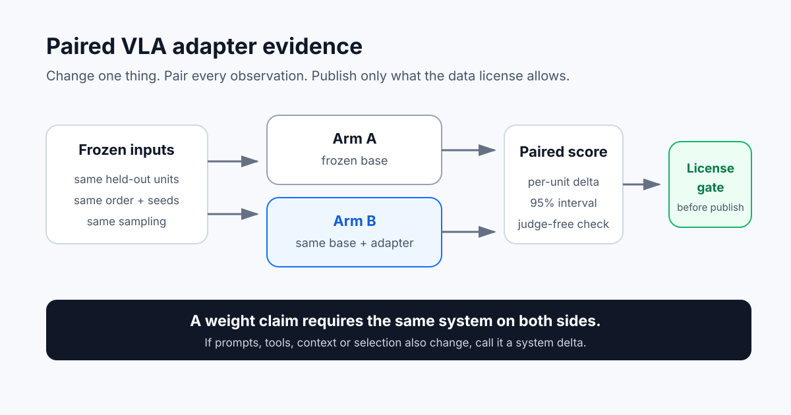

# NURM VLA Adaptation Evidence

Open-weight model, gated data: a public evidence-card template for adapting
vision-language-action models without disclosing the dataset or the training
engine.



This repository was motivated by a private NURM experiment with NVIDIA
Alpamayo 2 Super. It publishes the comparison discipline, adapter-audit
checklist and disclosure boundary. It does **not** publish NVIDIA dataset
material, dataset-derived outputs or measurements, NURM prompts, scorer or
reward logic, training code, or adapter weights.

The core idea is simple: if an adapter is claimed to improve a model, compare
the exact same base model on the exact same held-out inputs with the same
seeds and sampling profile. The intended difference between the two arms must
be the adapter alone.

## What is here

- a strict [public result-card schema](schemas/public-result-card.schema.json);
- a dependency-free [result-card verifier](verify.py);
- a clearly labelled [synthetic example](examples/SYNTHETIC_RESULT_CARD.json);
- a [paired experiment design](docs/PAIRED_DESIGN.md);
- an [adapter audit checklist](docs/ADAPTER_AUDIT_CHECKLIST.md);
- a [data-license publication gate](docs/DATA_LICENSE_BOUNDARY.md);
- a [permission-request template](docs/PERMISSION_REQUEST_TEMPLATE.md) for
  aggregate measurements governed by restricted data terms;
- a short [claim ladder](docs/CLAIM_LADDER.md) separating runtime selection
  from weight adaptation.

Run the public check:

```bash
python3 verify.py examples/SYNTHETIC_RESULT_CARD.json
```

Expected output:

```text
GREEN: valid public result card (SYNTHETIC_DEMO)
```

The verifier checks structure, arithmetic, matched-arm declarations,
disclosure flags and permission-reference shape. It does not recompute a
confidence interval from private per-item evidence, contact a rightsholder or
prove that a permission statement is authentic. A `PUBLIC_RESULT` permission
and its aggregate statistics remain the publisher's attestations. Numeric
metric fields are deliberately bounded to the public-card envelope from
`1e-12` through `1e12` in absolute value, with exact zero also allowed.

## Why the repository contains no Alpamayo result numbers

Alpamayo 2 Super is an open-weight 34B vision-language-action model. Its model
weights are under OpenMDW-1.1, and NVIDIA's source code is Apache-2.0. The
associated PhysicalAI-AV dataset uses a separate gated license. Its
confidentiality clause includes dataset output and performance or benchmarking
data. Public access to a model does not automatically make its training or
evaluation data—or measurements derived from that data—public.

For that reason, this release contains only the reusable protocol and a
synthetic fixture. A real result card should be published only when the data
license permits public performance disclosure or the rightsholder grants
written permission.

## Public / withheld boundary

| Public here | Deliberately absent |
|---|---|
| Official upstream model and license links | Dataset bytes, frames, clips or sensor streams |
| Generic paired-design diagram | Labels, raw outputs and event identifiers |
| D1 runtime vs D3 weight terminology | Train/eval membership and per-item tables |
| Adapter-audit checklist | Prompts, judges, traces and scoring logic |
| Synthetic schema fixture | Training scripts, adapter weights and artifact paths |
| Disclosure and claim gates | Real measurements lacking publication permission |

## What this proves

Nothing about a particular model result. It provides a reusable way to state
and mechanically check what a future public result card must disclose.

It does not establish an official benchmark result, safer driving, road
readiness, closed-loop performance, autonomous-driving improvement, or state
of the art.

## Upstream references

- [NVIDIA Alpamayo 2 Super model card](https://huggingface.co/nvidia/Alpamayo2-Super)
- [NVIDIA Alpamayo 2 Super source](https://github.com/NVlabs/alpamayo2)
- [PhysicalAI Autonomous Vehicles dataset and terms](https://huggingface.co/datasets/nvidia/PhysicalAI-Autonomous-Vehicles)

NURM and Obscyra Technologies are not affiliated with or endorsed by NVIDIA.
NVIDIA and Alpamayo are trademarks or names of their respective owner.

For the NURM publication-boundary record behind this template, see
[Alpamayo 2 Super adapter study — publication boundary](https://nurm.obscyra.app/log/#alpamayo-adapter).
